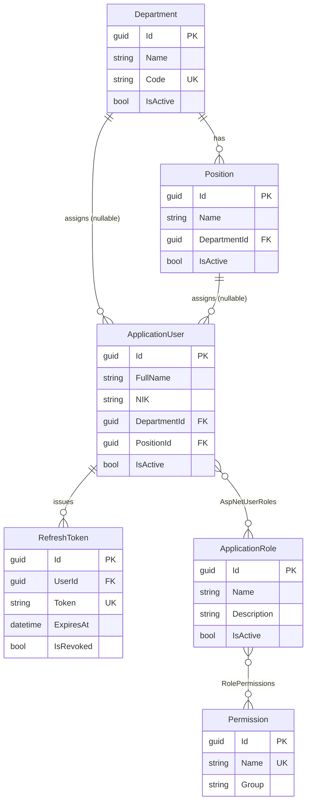
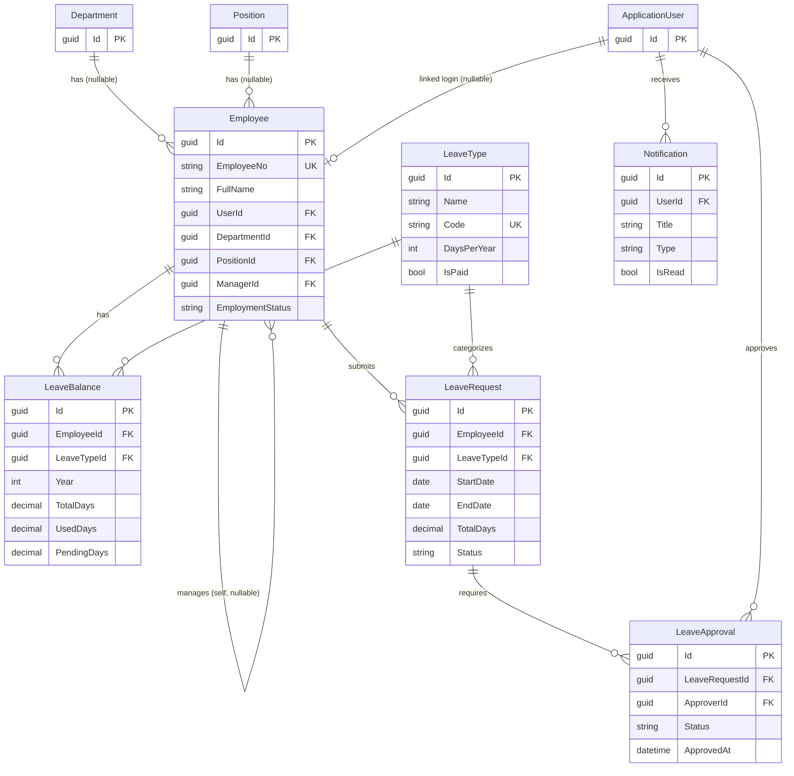
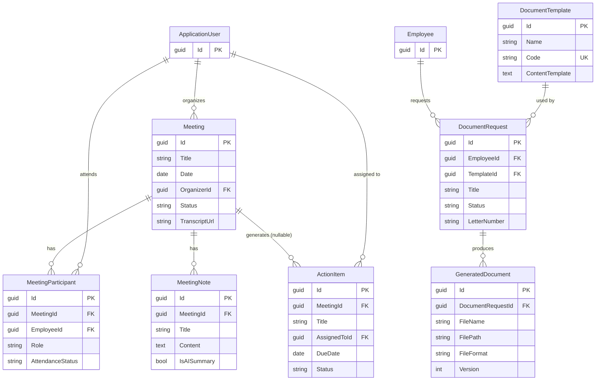
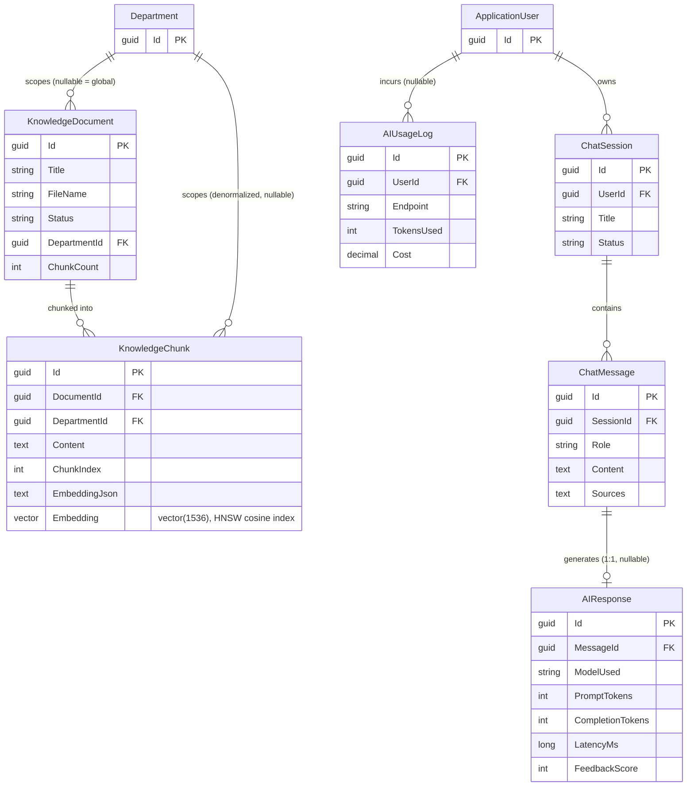
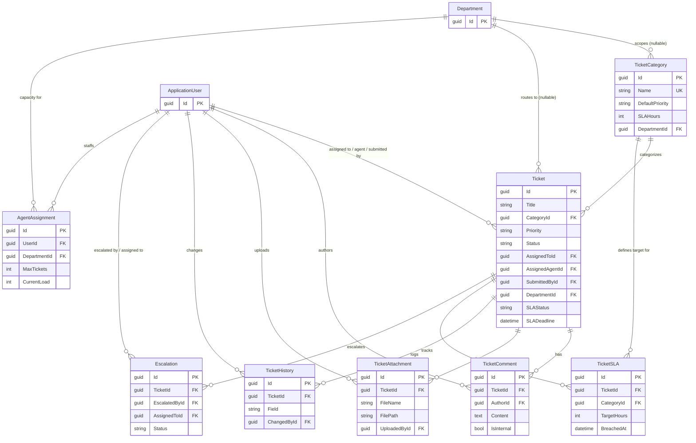
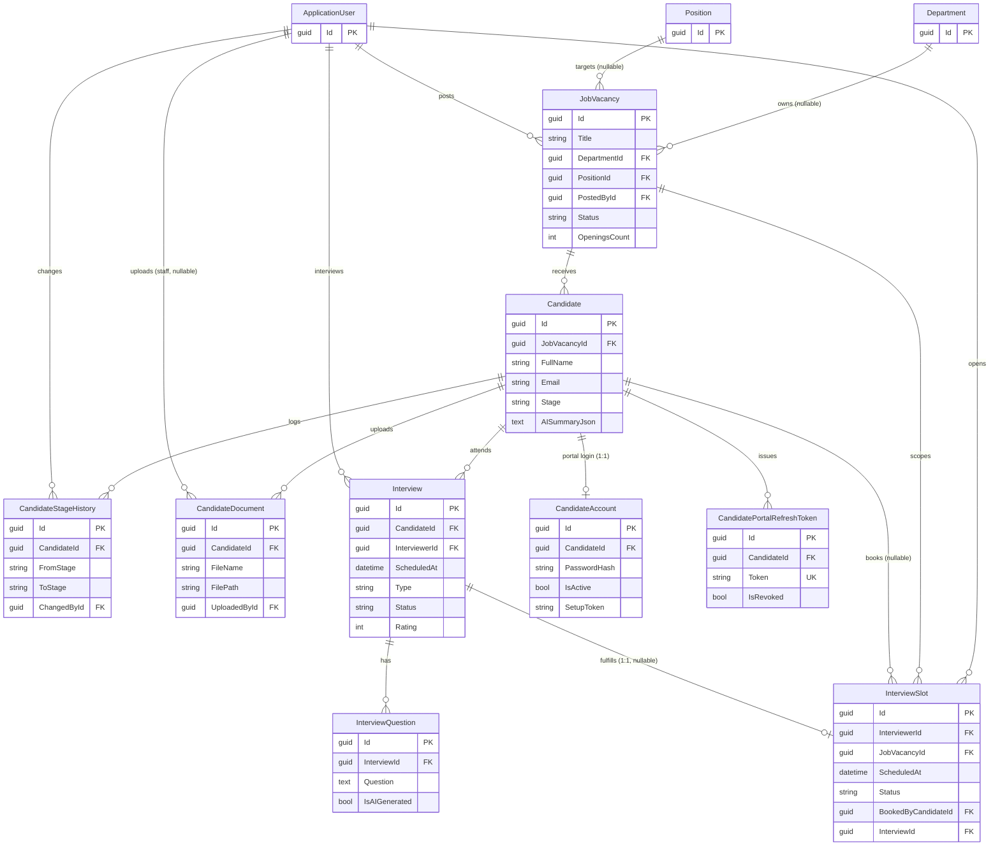

# AI Helpdesk — Digital Secretary & HR Assistant

An internal company application that serves as a **digital secretary** and **HR assistant**, powered by AI.

## Overview

AI Helpdesk centralizes administrative and HR services into a single application, reducing repetitive paperwork, accelerating employee request responses, and improving communication between employees, HR, and management.

### Key Capabilities

- **Digital Secretary** — Manage agendas, record & summarize meetings, generate letters & documents, handle internal requests, send work reminders
- **HR Assistant** — Manage employee data, process leave & permits, assist recruitment, answer policy questions, generate HR documents
- **AI-Powered Chat** — Conversational interface for employees to ask questions, submit requests, and search internal knowledge

## Demo Accounts

Login at <http://localhost:5173/login>.

> **Important:** These credentials are seeded by the backend on first startup (`DbSeeder`).

| Role | Email | Password |
|------|-------|----------|
| **Super Admin** | `admin@aihelpdesk.com` | `Admin@123` |
| **HRD** | `hrd@aihelpdesk.com` | `Hrd@12345` |
| **Secretary** | `secretary@aihelpdesk.com` | `Secretary@123` |
| **Manager** | `manager@aihelpdesk.com` | `Manager@123` |
| **Employee** | `employee@aihelpdesk.com` | `Employee@123` |

## Tech Stack

| Layer | Technology |
|-------|-----------|
| **Backend** | ASP.NET Core Web API (.NET) |
| **Frontend** | React 18 + TypeScript + Vite |
| **Database** | PostgreSQL 17 with pgvector |
| **AI / LLM** | OpenAI / Azure OpenAI (pluggable) |
| **Agentic Tools** | MCP (Model Context Protocol) — `ModelContextProtocol.AspNetCore` |
| **Auth** | JWT (access + refresh tokens), ASP.NET Core Identity |
| **CSS** | Tailwind CSS + shadcn/ui |
| **State** | Zustand (client), TanStack Query (server) |
| **Forms** | React Hook Form + Zod |
| **Charts** | Recharts |
| **ORM** | Entity Framework Core |
| **Mapping** | Mapster |
| **Validation** | FluentValidation |
| **Logging** | Serilog |
| **Testing** | xUnit, Moq, FluentAssertions, Bogus, Coverlet |
| **E2E / Screenshots** | Playwright |
| **Containerization** | Docker + Docker Compose |

## Architecture

### Backend — Clean Architecture

```
src/
├── AIHelpdesk.Api/            # ASP.NET Core Web API (controllers, middleware, Program.cs)
├── AIHelpdesk.Application/    # Use cases, service interfaces, DTOs
├── AIHelpdesk.Contracts/      # Request/response DTOs shared across layers
├── AIHelpdesk.Domain/         # Entities, enums, value objects, domain logic
└── AIHelpdesk.Infrastructure/ # EF Core, Identity, JWT, repositories, external services
```

### Frontend

```
frontend/src/
├── components/
│   ├── layout/                # AppShell, Sidebar, Topbar
│   └── ui/                    # shadcn/ui components
├── lib/                       # Axios instance, utilities
├── pages/                     # Page components (one per route)
└── store/                     # Zustand stores (auth, etc.)
```

## Data & Architecture Diagrams

### Data Flow Diagram

Two client surfaces — the internal React SPA (staff, default JWT scheme) and the external
candidate portal (separate `CandidatePortalScheme` audience, so one token can never satisfy the
other's `[Authorize]`) — talk to eight processes inside `AIHelpdesk.Api`. All persistent state
lands in one PostgreSQL instance; files never touch the database, only the shared
`/app/uploads` volume. The AI API is called directly by four processes rather than through a
shared gateway. **The dashed nodes/edges (Redis, message queue) are proposed, not present in the
codebase today** — `docker-compose.yml` defines only `postgres`/`backend`/`frontend`.

```mermaid
flowchart TD
    STAFF["Staff user\nReact SPA"]
    CAND["Candidate\nCandidate Portal"]
    AI["OpenAI-compatible API\nchat completions + embeddings"]

    subgraph PROC["AIHelpdesk.Api — processes"]
        direction TB
        P1(["1.0 Auth & Identity\ndual JWT schemes"])
        P2(["2.0 HR & Leave"])
        P3(["3.0 Secretary\nmeetings & documents"])
        P4(["4.0 Knowledge Base & AI Chat\nRAG pipeline"])
        P5(["5.0 Ticketing & SLA"])
        P6(["6.0 Recruitment\ninternal staff view"])
        P7(["7.0 Candidate Portal\nexternal self-service"])
        P8(["8.0 Background jobs\nSLA + reminder scan"])
    end

    subgraph STORE["PostgreSQL — ApplicationDbContext"]
        direction TB
        DS1[("Identity, Org\n& Notifications")]
        DS2[("HR & Leave")]
        DS3[("Secretary:\nMeetings & Docs")]
        DS4[("Knowledge, Chat\n& AI Usage")]
        DS5[("Tickets & SLA")]
        DS6[("Recruitment\n& Candidates")]
    end

    FILES[("Local disk\n/app/uploads volume")]

    STAFF -->|credentials| P1
    P1 -->|JWT + refresh token| STAFF
    P1 <--> DS1

    STAFF -->|leave / employee actions| P2
    P2 <--> DS2
    P2 -->|approval alerts| DS1

    STAFF -->|meeting / letter requests| P3
    P3 <--> DS3
    P3 -->|summary / draft prompt| AI
    AI -->|generated text| P3

    STAFF -->|chat message, KB upload| P4
    P4 <--> DS4
    P4 -->|source files| FILES
    P4 -->|embedding / completion request| AI
    AI -->|embeddings / completions| P4
    P4 -->|streamed answer| STAFF

    STAFF -->|create / update ticket, comment| P5
    P5 <--> DS5
    P5 -->|attachment files| FILES
    P5 -->|category / priority prompt| AI

    STAFF -->|vacancy / candidate / interview mgmt| P6
    P6 <--> DS6
    P6 -->|CV / offer files| FILES
    P6 -->|match / summarize / question-gen prompt| AI

    CAND -->|activate, login, upload, book slot| P7
    P7 <--> DS6
    P7 -->|CV files| FILES
    P7 -->|candidate-scoped JWT| CAND

    P8 -->|breach scan| DS5
    P8 -->|overdue scan| DS3
    P8 -->|writes alerts| DS1

    subgraph PROPOSED["Proposed additions — not in the codebase today"]
        direction TB
        QUEUE[["Message queue\n(proposed)"]]
        REDIS[("Redis\n(proposed)")]
    end

    P3 -.->|enqueue AI job| QUEUE
    P4 -.->|enqueue AI job| QUEUE
    P5 -.->|enqueue AI job| QUEUE
    P6 -.->|enqueue AI job| QUEUE
    QUEUE -.->|dispatch| AI
    QUEUE -.->|publish notification event| REDIS
    P8 -.->|publish overdue / breach event| QUEUE

    P1 -.->|distributed rate-limit counters| REDIS
    P4 -.->|cache KB search results| REDIS
    REDIS -.->|SignalR backplane: push to connected clients| STAFF

    classDef proposed stroke-dasharray: 4 3,stroke-width:1.5px;
    class QUEUE,REDIS proposed;
```



| Addition | Would replace / enable | Why it fits here |
| --- | --- | --- |
| Message queue | Synchronous, blocking AI calls (chat, embeddings, ticket triage, meeting summaries, recruitment matching) | `AIService` is a typed `HttpClient` with a 2-minute timeout called inline from 4 controllers — a queue would let those requests return immediately and complete async |
| Redis | The `NotificationHub` SignalR backplane, which is wired but currently passive | `NotificationService` only writes a `Notification` row today; nothing calls `IHubContext<NotificationHub>` to push it |
| Redis | In-process rate-limit counters and hot-path caches | `RateLimitingMiddleware` and KB search currently have no shared store, so counters/caches reset per instance and can't be load-balanced correctly |

### Entity Relationship Diagrams

All 33 entities reachable from `ApplicationDbContext`, grouped into six modules so each diagram
stays legible. Cross-module foreign keys (`ApplicationUser`, `Department`, `Position`,
`Employee`) appear as ID-only stubs inside a module and in full where they're owned. Every
entity also carries `BaseEntity` fields not repeated below: `CreatedAt`, `CreatedBy`,
`UpdatedAt`, `UpdatedBy`, `IsDeleted` — the last enforced as a global EF Core soft-delete query
filter on nearly every table.

#### 1. Identity & Access

Backs both ASP.NET Identity (`ApplicationUser`/`ApplicationRole` extend `IdentityUser<Guid>`/
`IdentityRole<Guid>`) and org structure. Every other module hangs off `ApplicationUser` and/or
`Department`/`Position`.



#### 2. HR & Leave

`Employee` is a distinct record from `ApplicationUser` — optionally linked, since not every
employee has a login and not every user is an employee. `Employee.ManagerId` self-references
for the reporting line.



*Delete rules:* Employee → LeaveBalance/LeaveRequest cascade; LeaveType and Approver restrict delete.

#### 3. Secretary — Meetings & Documents

Two independent flows sharing a module: meeting logistics (with an optional AI-generated
summary written into `MeetingNote`), and templated-letter generation (`DocumentTemplate` →
draft → approval → `GeneratedDocument` file).



*Delete rules:* Meeting → Participant/Note cascade; Meeting → ActionItem sets null.

#### 4. AI Chat & Knowledge Base

The RAG ingestion path: files are chunked into `KnowledgeChunk`, each chunk embedded twice —
`EmbeddingJson` (legacy text/JSON column, kept temporarily as a fallback/audit trail) and
`Embedding`, a native pgvector `vector(1536)` column backed by an HNSW cosine index
(`ix_knowledgechunks_embedding_hnsw`). `DepartmentId` is denormalized from the parent
`KnowledgeDocument` onto each `KnowledgeChunk` so retrieval can filter by department in the same
indexed query instead of joining, and search queries set `hnsw.ef_search`/`hnsw.iterative_scan`
per-request so a selective department filter can't silently return fewer than `topK` results.
`ChatMessage`↔`AIResponse` is a strict one-to-one carrying token/cost/latency metrics.



#### 5. Ticketing

The largest module: five child tables cascade from `Ticket` (comments, attachments, history,
SLA records, escalations), while its three user references (`AssignedTo`, `AssignedAgent`,
`SubmittedBy`) restrict or set-null on delete so removing a user never silently deletes ticket
history. `AgentAssignment` tracks per-agent, per-department capacity for auto-assignment.



*Delete rules:* Ticket → Comment/Attachment/History/SLA/Escalation cascade; Ticket → Category,
AssignedTo, SubmittedBy restrict; Ticket → AssignedAgent, Department set null.

#### 6. Recruitment & Candidate Portal

`Candidate` cannot foreign-key into `AspNetUsers`, so the candidate portal keeps its own
parallel `CandidateAccount` (1:1 login) and `CandidatePortalRefreshToken` rather than reusing
`ApplicationUser`/`RefreshToken`. Booking an `InterviewSlot` converts it into an `Interview`
row — the portal never creates `Interview` rows directly.



## Getting Started

### Prerequisites

- [Docker Desktop](https://www.docker.com/products/docker-desktop/)
- [.NET 9 SDK](https://dotnet.microsoft.com/download/dotnet/9.0) (for local development)
- [Node.js 18+](https://nodejs.org/) (for local frontend development)

### Quick Start (Docker)

```bash
# Clone the repository
git clone <repository-url>
cd portal-helpdesk

# Start all services (PostgreSQL, API, Frontend)
docker compose up -d --build
```

| Service | URL |
|---------|-----|
| **Frontend** | http://localhost:5173 |
| **Backend API** | http://localhost:5192 |
| **Swagger UI** | http://localhost:5192/swagger |
| **MCP Server** | http://localhost:5192/mcp (JWT bearer auth required — see [MCP Server (Agentic Tools)](#mcp-server-agentic-tools)) |
| **PostgreSQL** | `localhost:5432` (user: `helpdesk`, password: `helpdesk123`, db: `aihelpdesk`) |

### Local Development

#### Backend

```bash
cd src/AIHelpdesk.Api
dotnet restore
dotnet run
```

#### Frontend

```bash
cd frontend
npm install
npm run dev
```

#### Database

```bash
# Start only PostgreSQL
docker compose up -d postgres

# Apply EF Core migrations
cd src/AIHelpdesk.Api
dotnet ef database update
```

### Running Tests

#### Unit Tests (Backend)

```bash
cd tests/AIHelpdesk.Tests
dotnet test
```

#### E2E Tests (Playwright)

```bash
cd frontend

# Install Playwright browsers (first time only)
npx playwright install chromium

# Run all 57 E2E tests (headless)
npm run test:e2e

# Interactive UI mode
npm run test:e2e:ui
```

> See [`documentation/e2e-testing.md`](documentation/e2e-testing.md) for the full E2E guide.
> See [`tests/Summary.md`](tests/Summary.md) for the complete testing strategy across all disciplines.

### Test Coverage

> Full report: [`test-coverage-report.md`](test-coverage-report.md)

| Phase | Backend (xUnit) | E2E Smoke | E2E Interaction | Status |
|-------|-----------------|-----------|-----------------|--------|
| Phase 1 — Foundation MVP | 31 | 13 | — | ✅ Backend passing |
| Phase 2 — HR Administration | 46 | 4 | 27 | ✅ Backend passing |
| Phase 3 — Secretary Module | 54 | 6 | — | ✅ Backend passing |
| Phase 4 — AI Helpdesk Chat | 56 | — | — | ✅ Backend passing (no E2E yet) |
| Phase 5 — Ticketing | 49 | — | — | ✅ Backend passing (no E2E yet) |
| Phase 6 — Recruitment | 37 | — | — | ✅ Backend passing (no E2E yet) |
| Phase 7 — Hardening & Deployment | 6 | — | — | 🔧 In progress (see below) |
| Phase 8 — Candidate Portal | 19 | — | 7 | ✅ Backend + E2E passing |
| **Total** | **301** | **23** | **34** | — |

**Backend (301 tests):** xUnit + Moq + FluentAssertions + Bogus, run and passing as of 2026-08-05.
No frontend (Vitest) unit tests exist yet for any phase.
**Phase 8 audience isolation:** the candidate self-service portal (`/api/candidate-portal/*`)
uses a fully separate JWT audience (`AIHelpdesk-CandidatePortal` vs the staff `AIHelpdesk`) so a
candidate token cannot satisfy `[Authorize]` on any internal endpoint by construction. Manually
verified 2026-08-05 against a rebuilt Docker stack: candidate token → staff endpoint (401), staff
token → candidate-portal endpoint (401), each token → its own endpoints (200). See
[`documentation/context-candidate.md`](documentation/context-candidate.md) for the design and
[`test-coverage-report.md`](test-coverage-report.md) for the full test breakdown.
**E2E (23 smoke + 34 interaction):** actually run 2026-08-05 against a live Docker Compose stack
rebuilt from current code — **56/57 passing**. The original 50-test suite's first run (18/50)
surfaced two real bugs: `RoleGuard` checked `'SuperAdmin'` (no space) against the actual
`"Super Admin"` role, and `authStore.user` never got populated on a hard page load since nothing
called the `loadUser()` function that set it. Fixing both got to 42/50; the remaining 8 all
traced to the Phase 7 general rate limiter (originally 100 req/min, one bucket per user across
the whole API) getting exhausted — confirmed even on a clean run, not just a
50-tests-with-zero-think-time artifact, so the default was raised to 300 req/min, landing at
49/50 (one unrelated pre-existing test-data race remains). The 7 Phase 8 candidate-portal tests
added 2026-08-05 all pass, bringing the suite to 56/57. See
[`test-coverage-report.md`](test-coverage-report.md) for the full writeup, the three test/UI-copy
mismatches fixed along the way, and the interviewer-conflict test flake found and fixed while
adding the Phase 8 tests.  
**Phase 3 Code Coverage (coverlet):**
- Services: MeetingService 93.6%, ActionItemService 97.8%, DocumentService 93.8%
- Domain entities: Meeting, MeetingNote, MeetingParticipant, ActionItem, DocumentTemplate, DocumentRequest, GeneratedDocument — **all 100%**
- Contracts: 21 request/response DTOs — 8 at 100%, remainder partial (no integration tests)
- Controllers: 37 action methods — 0% (integration tests planned but not yet written)
- 3 uncovered service methods: `GetNotesAsync`, `GenerateSummaryAsync`, `GetTeamActionItemsAsync`, `DownloadDocumentAsync`  
**E2E (57 tests):** 23 smoke (screenshot + heading) across all pages + 27 interaction (dialog, form, search, CRUD) for Phase 2 + 7 full-flow tests (login, activation, documents, interview booking) for Phase 8  
**Grand total:** 358 tests

## API Endpoints (Phase 1 — Foundation MVP)

### Authentication
| Method | Endpoint | Description |
|--------|----------|-------------|
| POST | `/api/auth/login` | Login, returns access + refresh token |
| POST | `/api/auth/refresh-token` | Refresh access token |
| POST | `/api/auth/logout` | Revoke refresh token |
| POST | `/api/auth/forgot-password` | Send password reset link |
| POST | `/api/auth/reset-password` | Reset password with token |
| GET | `/api/auth/profile` | Get current user profile |
| PUT | `/api/auth/profile` | Update own profile |
| PUT | `/api/auth/change-password` | Change password |

### Users
| Method | Endpoint | Description |
|--------|----------|-------------|
| GET | `/api/users` | List users (paginated, filterable) |
| GET | `/api/users/{id}` | Get user detail |
| POST | `/api/users` | Create user |
| PUT | `/api/users/{id}` | Update user |
| DELETE | `/api/users/{id}` | Soft-delete user |
| POST | `/api/users/{id}/activate` | Activate user |
| POST | `/api/users/{id}/deactivate` | Deactivate user |

### Roles & Permissions
| Method | Endpoint | Description |
|--------|----------|-------------|
| GET | `/api/roles` | List roles |
| POST | `/api/roles` | Create role |
| PUT | `/api/roles/{id}` | Update role |
| DELETE | `/api/roles/{id}` | Delete role |
| GET | `/api/roles/{id}/permissions` | Get role permissions |
| PUT | `/api/roles/{id}/permissions` | Assign permissions |

### Departments & Positions
| Method | Endpoint | Description |
|--------|----------|-------------|
| GET | `/api/departments` | List departments |
| POST | `/api/departments` | Create department |
| PUT | `/api/departments/{id}` | Update department |
| GET | `/api/positions` | List positions |
| POST | `/api/positions` | Create position |
| PUT | `/api/positions/{id}` | Update position |

## API Endpoints (Phase 2 — HR Administration)

### Employees
| Method | Endpoint | Description |
|--------|----------|-------------|
| GET | `/api/employees` | List employees (paginated, filterable by search, department, status) |
| GET | `/api/employees/{id}` | Get employee detail |
| POST | `/api/employees` | Create employee |
| PUT | `/api/employees/{id}` | Update employee |
| DELETE | `/api/employees/{id}` | Soft-delete employee |
| POST | `/api/employees/import` | Import employees from Excel |
| GET | `/api/employees/export` | Export employees to Excel |

### Leave Types
| Method | Endpoint | Description |
|--------|----------|-------------|
| GET | `/api/leave-types` | List leave types |
| GET | `/api/leave-types/{id}` | Get leave type detail |
| POST | `/api/leave-types` | Create leave type |
| PUT | `/api/leave-types/{id}` | Update leave type |
| DELETE | `/api/leave-types/{id}` | Soft-delete leave type |

### Leave Balances
| Method | Endpoint | Description |
|--------|----------|-------------|
| GET | `/api/leave-balances/my` | Get current user's leave balances |
| GET | `/api/leave-balances/employee/{employeeId}` | Get an employee's leave balances (Manager/HRD) |
| POST | `/api/leave-balances/adjust` | Adjust leave balance (HRD/Super Admin) |

### Leave Requests
| Method | Endpoint | Description |
|--------|----------|-------------|
| GET | `/api/leave-requests` | List leave requests (paginated, filterable) |
| GET | `/api/leave-requests/{id}` | Get leave request detail with approval history |
| POST | `/api/leave-requests` | Create leave request (Draft) |
| PUT | `/api/leave-requests/{id}` | Update draft leave request |
| POST | `/api/leave-requests/{id}/submit` | Submit for approval |
| POST | `/api/leave-requests/{id}/approve` | Approve leave request |
| POST | `/api/leave-requests/{id}/reject` | Reject leave request |
| POST | `/api/leave-requests/{id}/cancel` | Cancel leave request |

### Leave Approvals (Pending Queue)
| Method | Endpoint | Description |
|--------|----------|-------------|
| GET | `/api/leave-requests/pending-approval` | List pending approvals for current user |

> Approve/reject actions use the `POST /api/leave-requests/{id}/approve` and `POST /api/leave-requests/{id}/reject` endpoints listed above.

### Notifications
| Method | Endpoint | Description |
|--------|----------|-------------|
| GET | `/api/notifications` | List notifications for current user |
| GET | `/api/notifications/unread-count` | Get unread count |
| PUT | `/api/notifications/{id}/read` | Mark notification as read |
| PUT | `/api/notifications/read-all` | Mark all as read |

## API Endpoints (Phase 3 — Secretary Module)

### Meetings
| Method | Endpoint | Description |
|--------|----------|-------------|
| GET | `/api/meetings` | List meetings (paginated, filterable by date range, status) |
| GET | `/api/meetings/{id}` | Get meeting detail with participants, notes & action items |
| POST | `/api/meetings` | Create meeting |
| PUT | `/api/meetings/{id}` | Update meeting |
| DELETE | `/api/meetings/{id}` | Soft-delete meeting |
| GET | `/api/meetings/today` | Get today's meetings for current user |
| GET | `/api/meetings/upcoming` | Get upcoming meetings (next 7 days) |
| POST | `/api/meetings/{id}/participants` | Add participant |
| DELETE | `/api/meetings/{id}/participants/{participantId}` | Remove participant |
| POST | `/api/meetings/{id}/notes` | Add meeting note |
| PUT | `/api/meetings/{id}/notes/{noteId}` | Update meeting note |
| DELETE | `/api/meetings/{id}/notes/{noteId}` | Delete meeting note |
| GET | `/api/meetings/{id}/notes` | Get all notes for a meeting |
| POST | `/api/meetings/{id}/generate-summary` | Generate AI-powered meeting summary from notes |

### Action Items
| Method | Endpoint | Description |
|--------|----------|-------------|
| GET | `/api/action-items` | List my action items (paginated, filterable by status) |
| GET | `/api/action-items/{id}` | Get action item detail |
| POST | `/api/action-items` | Create action item |
| PUT | `/api/action-items/{id}` | Update action item |
| POST | `/api/action-items/{id}/complete` | Mark action item as completed |
| POST | `/api/action-items/{id}/cancel` | Cancel action item |
| GET | `/api/action-items/overdue` | Get overdue action items |
| GET | `/api/action-items/team` | Get team action items (manager) |

### Document Templates
| Method | Endpoint | Description |
|--------|----------|-------------|
| GET | `/api/document-templates` | List templates (filterable by category) |
| GET | `/api/document-templates/{id}` | Get template detail |
| POST | `/api/document-templates` | Create template |
| PUT | `/api/document-templates/{id}` | Update template |
| DELETE | `/api/document-templates/{id}` | Soft-delete template |

### Document Requests
| Method | Endpoint | Description |
|--------|----------|-------------|
| GET | `/api/document-requests` | List requests (paginated, filterable by status) |
| GET | `/api/document-requests/{id}` | Get request detail with generated documents |
| POST | `/api/document-requests` | Create document request (Draft) |
| PUT | `/api/document-requests/{id}` | Update draft content |
| POST | `/api/document-requests/{id}/generate-draft` | Generate AI draft from template |
| POST | `/api/document-requests/{id}/submit-for-review` | Submit for review |
| POST | `/api/document-requests/{id}/approve` | Approve document |
| POST | `/api/document-requests/{id}/reject` | Reject with reason |
| POST | `/api/document-requests/{id}/generate-final` | Generate final document with letter number |
| GET | `/api/document-requests/{id}/download` | Download generated document |

## API Endpoints (Phase 4 — AI Helpdesk Chat)

### AI Chat
| Method | Endpoint | Description |
|--------|----------|-------------|
| POST | `/api/ai/chat` | Send a message, returns the full session detail |
| POST | `/api/ai/chat/stream` | Send a message with a streaming (SSE) response |
| GET | `/api/ai/conversations` | List chat sessions (paginated) |
| GET | `/api/ai/conversations/{id}` | Get session detail with messages |
| PUT | `/api/ai/conversations/{id}` | Rename / update a session |
| DELETE | `/api/ai/conversations/{id}` | Soft-delete a session |
| POST | `/api/ai/conversations/{sessionId}/escalate` | Escalate conversation to a human agent |
| POST | `/api/ai/responses/{messageId}/feedback` | Submit thumbs up/down feedback |
| GET | `/api/ai/health` | Health check (verifies DB connectivity) |
| GET | `/api/ai/usage` | AI usage statistics (Super Admin only) |

### Knowledge Base
| Method | Endpoint | Description |
|--------|----------|-------------|
| GET | `/api/knowledge-documents` | List documents (paginated, filterable by status) |
| GET | `/api/knowledge-documents/{id}` | Get document detail with chunks |
| POST | `/api/knowledge-documents` | Upload PDF/DOCX/TXT (max 20 MB, Secretary/HR Admin/Super Admin) |
| POST | `/api/knowledge-documents/{id}/index` | (Re)index a document into embeddings |
| POST | `/api/knowledge-documents/search` | Semantic search over the knowledge base, scoped to the caller's department |
| DELETE | `/api/knowledge-documents/{id}` | Delete document (Super Admin only) |

## API Endpoints (Phase 5 — Ticketing System)

### Tickets
| Method | Endpoint | Description |
|--------|----------|-------------|
| GET | `/api/tickets` | List my tickets (paginated, filterable by status/priority) |
| GET | `/api/tickets/assigned` | List tickets assigned to the current agent |
| GET | `/api/tickets/department/{departmentId}` | List department tickets (Manager/Super Admin) |
| GET | `/api/tickets/queue` | Get agent queue (filterable by department/status/priority) |
| GET | `/api/tickets/stats` | Ticket statistics (agent/manager) |
| GET | `/api/tickets/sla-report` | SLA compliance report (Manager/Super Admin) |
| GET | `/api/tickets/{id}` | Get ticket detail with comments & attachments |
| POST | `/api/tickets` | Create ticket |
| PUT | `/api/tickets/{id}` | Update ticket |
| PUT | `/api/tickets/{id}/status` | Update ticket status |
| POST | `/api/tickets/{id}/assign` | Assign ticket to an agent |
| POST | `/api/tickets/{id}/comment` | Add a comment |
| POST | `/api/tickets/{id}/resolve` | Resolve ticket |
| POST | `/api/tickets/{id}/close` | Close ticket |
| POST | `/api/tickets/{id}/reopen` | Reopen ticket |
| POST | `/api/tickets/{id}/upload` | Upload attachment (max 10 MB) |
| GET | `/api/tickets/{id}/attachments/{attachmentId}/download` | Download attachment |
| DELETE | `/api/tickets/{id}/attachments/{attachmentId}` | Delete attachment |
| GET | `/api/tickets/export` | Export tickets to Excel |
| POST | `/api/tickets/ai-suggestion` | Get AI category & priority suggestion |

### Ticket Categories
| Method | Endpoint | Description |
|--------|----------|-------------|
| GET | `/api/ticket-categories` | List categories (filterable by department) |
| GET | `/api/ticket-categories/{id}` | Get category detail |
| POST | `/api/ticket-categories` | Create category (Super Admin/Manager) |
| PUT | `/api/ticket-categories/{id}` | Update category (Super Admin/Manager) |
| DELETE | `/api/ticket-categories/{id}` | Delete category (Super Admin) |

### Escalations
| Method | Endpoint | Description |
|--------|----------|-------------|
| GET | `/api/escalations` | List escalations (paginated, filterable by department/status) |
| GET | `/api/escalations/pending` | Get pending escalations for a department |
| POST | `/api/escalations` | Create an escalation for a ticket |
| POST | `/api/escalations/{id}/accept` | Accept escalation |
| POST | `/api/escalations/{id}/resolve` | Resolve escalation |
| POST | `/api/escalations/{id}/decline` | Decline escalation |

### Agent Assignments
| Method | Endpoint | Description |
|--------|----------|-------------|
| GET | `/api/agent-assignments` | List all agent assignments |
| GET | `/api/agent-assignments/department/{departmentId}` | List assignments for a department |
| POST | `/api/agent-assignments` | Create assignment (Super Admin) |
| PUT | `/api/agent-assignments/{id}` | Update assignment (Super Admin) |
| DELETE | `/api/agent-assignments/{id}` | Delete assignment (Super Admin) |

## API Endpoints (Phase 6 — Recruitment)

### Job Vacancies
| Method | Endpoint | Description |
|--------|----------|-------------|
| GET | `/api/job-vacancies` | List vacancies (paginated, filterable by status/department) |
| GET | `/api/job-vacancies/{id}` | Get vacancy detail |
| POST | `/api/job-vacancies` | Create vacancy |
| PUT | `/api/job-vacancies/{id}` | Update vacancy |
| POST | `/api/job-vacancies/{id}/publish` | Publish vacancy |
| POST | `/api/job-vacancies/{id}/close` | Close vacancy |
| POST | `/api/job-vacancies/{id}/ai-match` | AI candidate matching against requirements |

### Candidates
| Method | Endpoint | Description |
|--------|----------|-------------|
| GET | `/api/candidates` | List candidates (paginated, filterable by stage/vacancy) |
| GET | `/api/candidates/stats` | Recruitment statistics |
| GET | `/api/candidates/export` | Export candidates to Excel |
| GET | `/api/candidates/{id}` | Get candidate detail |
| POST | `/api/candidates` | Create candidate |
| PUT | `/api/candidates/{id}` | Update candidate |
| POST | `/api/candidates/{id}/cv` | Upload CV (max 5 MB) |
| GET | `/api/candidates/{id}/cv/{documentId}` | Download candidate CV |
| DELETE | `/api/candidates/{id}/cv/{documentId}` | Delete candidate CV (removes DB record + file on disk) |
| POST | `/api/candidates/{id}/advance-stage` | Advance to the next pipeline stage |
| POST | `/api/candidates/{id}/reject` | Reject candidate |
| POST | `/api/candidates/{id}/ai-summarize` | AI CV summarization |

### Interviews
| Method | Endpoint | Description |
|--------|----------|-------------|
| GET | `/api/interviews` | List interviews (paginated, filterable by date range/candidate) |
| GET | `/api/interviews/upcoming` | Get upcoming interviews (filterable by interviewer) |
| GET | `/api/interviews/{id}` | Get interview detail |
| POST | `/api/interviews` | Schedule interview |
| PUT | `/api/interviews/{id}` | Update interview |
| POST | `/api/interviews/{id}/complete` | Complete interview with feedback |
| POST | `/api/interviews/{id}/cancel` | Cancel interview |
| POST | `/api/interviews/{id}/ai-questions` | Generate AI interview questions |

## MCP Server (Agentic Tools)

An [MCP](https://modelcontextprotocol.io/) (Model Context Protocol) server is hosted alongside
the REST API at `POST /mcp`, using the official `ModelContextProtocol.AspNetCore` SDK. It exposes
backend capabilities as tools an LLM agent can call directly, as a separate surface from the
request/response RAG chat in `/api/ai/chat`.

The `/mcp` endpoint sits behind the same JWT bearer auth as the rest of the API
(`.RequireAuthorization()` in `Program.cs`), but MCP tool calls don't pass through ASP.NET Core's
`[Authorize(Roles=...)]` action filters the way controller actions do — each tool re-derives the
caller's identity via `IHttpContextAccessor` and enforces its own authorization.

### Ticket Agent

The only agent implemented so far (`src/AIHelpdesk.Api/Mcp/TicketMcpTools.cs`), wrapping
`ITicketService`:

| Tool | Description |
|------|-------------|
| `create_ticket` | Create a ticket on behalf of the calling user |
| `get_ticket` | Get a ticket by id — visible only to its submitter, its assigned agent, or staff (Agent/Manager/Super Admin) |
| `update_ticket` | Update a ticket's title/description/sub-category/priority — same visibility rule as `get_ticket` |
| `get_sla` | Get a ticket's SLA deadline and status — same visibility rule as `get_ticket` |

**Note:** while building this, `TicketsController.GetById`/`Update` were found to have no
ownership check at the REST layer at all — any authenticated user can currently read or update
any ticket by id via `GET/PUT /api/tickets/{id}`. That gap has not been fixed yet, but the MCP
tools above don't inherit it: each one independently checks the caller is the submitter, the
assigned agent, or holds a staff role before calling into `ITicketService`, so an LLM-driven
agent can't be used to read or edit another employee's ticket even though the REST endpoint
currently would allow it.

**Status (2026-08-07):** Ticket Agent implemented and verified end-to-end against a live instance
(tool listing, create, and all three ownership-scoping cases — owner, staff, and unrelated
non-staff user — confirmed by hand). HR Agent (`get_employee`, `get_leave_balance`,
`create_leave_request`) and Recruitment Agent (`search_candidates`, `evaluate_candidate`,
`get_candidate`) follow the same pattern but are not yet built.

## User Roles

| Role | Description |
|------|-------------|
| **Super Admin** | Full system access — manage users, roles, departments, and all settings |
| **HRD** | Manage employee data, process leave/permits, create HR documents, upload policies |
| **Secretary / Admin** | Manage agendas, meeting minutes, incoming/outgoing letters, announcements |
| **Manager** | View dashboards, approve leave & documents, view reports |
| **Employee** | Submit leave & permit requests, ask policy questions, view announcements |

## Project Phases

| Phase | Focus | Status |
|-------|-------|--------|
| **Phase 1** | Foundation MVP — Auth, users, roles, departments, base layout | ✅ Done |
| **Phase 2** | HR Administration — Employee data, leave management, notifications | ✅ Done |
| **Phase 3** | Secretary Module — Meetings, agendas, documents, action items | ✅ Done |
| **Phase 4** | AI Helpdesk Chat — AI-powered RAG chat & knowledge base | ✅ Done |
| **Phase 5** | Ticketing System — Request tracking, SLA, agent workflows | ✅ Done |
| **Phase 6** | Recruitment — Job postings, candidate pipeline, AI CV parsing | ✅ Done |
| **Phase 7** | Hardening & Deployment — Security, performance, CI/CD, monitoring | 🔧 In progress (~44% of checklist, 45/103 tasks as of 2026-08-09 — see [`documentation/todo-phase-7-hardening.md`](documentation/todo-phase-7-hardening.md)) |

Detailed documentation for each phase is available in the [`documentation/`](documentation/)
directory. For the full functional specification (requirements, workflows, business rules, and
role permissions as actually implemented — verified against the code, not just the original
plan), see [`documentation/FSD.md`](documentation/FSD.md).

---

### Phase 1 — Foundation (MVP)

**Deliverables:**
| # | Deliverable | Description |
|---|-------------|-------------|
| 1 | Backend scaffolding | Clean Architecture: Api → Application → Domain → Infrastructure |
| 2 | Frontend scaffolding | React + Vite + TypeScript + Tailwind CSS + shadcn/ui |
| 3 | Database schema | Users, Roles, Permissions, Departments, Positions, RefreshTokens |
| 4 | Authentication API | Login, logout, refresh token, forgot/reset password, profile management |
| 5 | User management | CRUD users, assign roles, activate/deactivate, pagination & search |
| 6 | Role & permission management | RBAC with granular CRUD permissions |
| 7 | Department & position management | CRUD departments and positions |
| 8 | Base layout & navigation | Role-based sidebar + topbar navigation |
| 9 | Docker setup | Multi-container: PostgreSQL + Backend + Frontend |
| 10 | API documentation | Swagger/OpenAPI at `/swagger` |

**Database tables:** `AspNetUsers`, `AspNetRoles`, `AspNetUserRoles`, `Permissions`, `Departments`, `Positions`, `RefreshTokens`

---

### Phase 2 — Employee & HR Administration

**Deliverables:**
| # | Deliverable | Description |
|---|-------------|-------------|
| 1 | Employee management | Full CRUD with import/export Excel, search & filter |
| 2 | Leave types & balance | Configurable leave types, per-year balance tracking |
| 3 | Leave request workflow | Submit → Manager approval → HR verification → Approved/Rejected |
| 4 | Manager approval dashboard | Pending approvals queue with batch actions |
| 5 | In-app notifications | Real-time alerts via SignalR for approvals & updates |
| 6 | Employee dashboard | Leave balance, recent requests, quick actions |
| 7 | HR dashboard | Employee count, pending verifications, department stats |

**New tables:** `Employees`, `LeaveTypes`, `LeaveBalances`, `LeaveRequests`, `LeaveApprovals`, `Notifications`

**Leave status flow:** `Draft → Submitted → Waiting for Manager → Waiting for HR → Approved / Rejected`

---

### Phase 3 — Secretary Module

**Deliverables:**
| # | Deliverable | Description |
|---|-------------|-------------|
| 1 | Meeting & agenda management | Create, schedule, update meetings with participants |
| 2 | Meeting notes & minutes | Record notes, AI-generated meeting summaries (✅ backend + frontend done) |
| 3 | Action items | Track follow-ups with assignee, priority, and deadline |
| 4 | Document/surat request workflow | Request → AI draft → Review → Approve → Generate PDF/DOCX |
| 5 | Document templates | Manage reusable letter templates with variable fields |
| 6 | Secretary dashboard | Today's agenda, pending reviews, overdue action items |
| 7 | AI summary button | One-click AI meeting summary generation from notes (Sparkles button) |
| 8 | Participant selector | Searchable multi-select employee picker for meeting participants |

**New frontend components:** `AISummaryButton`, `ParticipantSelector` (reusable)

**New tables:** `Meetings`, `MeetingParticipants`, `MeetingNotes`, `ActionItems`, `DocumentTemplates`, `DocumentRequests`, `GeneratedDocuments`

**Document request flow:** `Draft → Submitted → AI Draft Ready → Review → Approved → Generated`
**Action item flow:** `Open → In Progress → Completed`

---

### Phase 4 — AI Helpdesk Chat & Knowledge Base

**Deliverables:**
| # | Deliverable | Description |
|---|-------------|-------------|
| 1 | AI Chat interface | Conversational UI with streaming responses |
| 2 | Knowledge base management | Upload PDF/DOCX/TXT, automatic chunking & indexing |
| 3 | RAG pipeline | Document → Chunk → Embed (pgvector) → Retrieve → Generate (LLM) |
| 4 | Source attribution | Show which documents were used for each AI answer |
| 5 | AI feedback system | Thumbs up/down on responses for quality tracking |
| 6 | Human escalation | Transfer chat to human agent when AI cannot answer |
| 7 | Conversation history | Persistent chat sessions per user |
| 8 | AI guardrails | Permission-aware answers, no unauthorized data access |

**New tables:** `KnowledgeDocuments`, `KnowledgeChunks` (with `vector(1536)` embedding), `ChatSessions`, `ChatMessages`, `AIResponses`, `AIUsageLog`

**AI stack:** OpenAI/Azure OpenAI + pgvector for semantic search + RAG pattern

**Status (2026-08-11):** `AIOptions` now supports an optional separate
`EmbeddingEndpoint`/`EmbeddingApiKey` pair (falling back to the main `Endpoint`/`ApiKey` when
unset), so a chat-completion provider without an embeddings API of its own (e.g. DeepSeek) can be
paired with a different provider (e.g. OpenAI) for embeddings only — `AIService` now builds each
request's URI/Authorization header per-call instead of relying on a client-wide `BaseAddress`.
`IAIService` also exposes `ChatModel` so `ChatService` records the model actually configured
(`AIResponse.ModelUsed`) instead of a hardcoded `"gpt-4o-mini"` string. Fixed a streaming-chat bug
where `POST /api/ai/chat/stream`'s final SSE payload was serialized with
`JsonSerializer.Serialize()` directly (bypassing ASP.NET's normal camelCasing pipeline), so its
`session.Id` stayed PascalCase while the frontend read `session?.id` — a brand-new chat's session
id was always `undefined`, so it never got selected or added to the sidebar until a manual
refresh forced a correctly-cased `GET /api/ai/conversations`. On the frontend, the standalone
`ChatSessionPage` (route `/ai/chat/:sessionId`) was merged into `ChatPage` — the conversation
list now opens a session by navigating to `/ai/chat` with `{ state: { sessionId } }` router state
instead of a duplicate route/page, and the message input stays visible even with no active
session so starting a fresh chat (or continuing after an escalation) always has somewhere to type.

---

### Phase 5 — Ticketing System

**Deliverables:**
| # | Deliverable | Description |
|---|-------------|-------------|
| 1 | Ticket CRUD | Create, update, view, filter tickets across departments |
| 2 | Ticket assignment | Manual assignment + auto-assignment pool by department |
| 3 | Comments & attachments | Threaded comments with file uploads |
| 4 | Status workflow | Open → Assigned → In Progress → Resolved → Closed |
| 5 | SLA tracking | Per-category SLA targets with breach detection & alerts |
| 6 | AI categorization | Auto-detect category & suggest priority on ticket creation |
| 7 | Agent dashboard | Queue view, SLA breaches, performance metrics |
| 8 | Escalation management | Multi-level escalation (Agent → Supervisor → Super Admin) |

**New tables:** `Tickets`, `TicketCategories`, `TicketComments`, `TicketAttachments`, `TicketHistory`, `TicketSLA`, `Escalations`, `AgentAssignments`

**Status flow:** `Open → Assigned → In Progress → Resolved → Closed / Reopened`

---

### Phase 6 — Recruitment Assistant

**Deliverables:**
| # | Deliverable | Description |
|---|-------------|-------------|
| 1 | Job vacancy management | Create, publish, close job postings with requirements |
| 2 | Candidate pipeline | Track candidates through hiring stages (Kanban-style) |
| 3 | CV upload & storage | Upload CV files with AI summarization |
| 4 | AI CV summarization | Auto-extract skills, experience, education from CV documents |
| 5 | AI interview questions | Generate role-specific interview questions |
| 6 | Interview scheduling | Schedule interviews, record feedback & ratings |
| 7 | Candidate comparison | Compare CVs against job requirements side-by-side |

**New tables:** `JobVacancies`, `Candidates`, `CandidateStages`, `Interviews`, `InterviewQuestions`, `CandidateDocuments`

**Pipeline stages:** `Applied → Screening → Test → Interview → Offering → Hired / Rejected`

**Status (2026-08-11):** AI CV summarization is done end-to-end and verified working. CV text
extraction (`RecruitmentAIService`, shared approach with `KnowledgeBaseService`'s KB indexing) now
uses real PDF parsing via **PdfPig** instead of a raw-bytes regex scan for `(...) Tj` operators —
the old scanner could never see text in the compressed (FlateDecode) streams that almost all
real-world PDFs (Word/Google Docs/Canva exports) use, so real CVs silently extracted to an empty
string and the LLM fabricated a plausible-looking summary from nothing. A CV with no extractable
text (e.g. a scanned image with no text layer) now returns a clear "could not extract readable
text" result instead of a hallucinated one, and `KnowledgeBaseService` fails the document loudly
(status `Failed` with an `ErrorMessage`) rather than indexing empty/placeholder text. Candidates
can now also delete an uploaded CV (`DELETE /api/candidates/{id}/cv/{documentId}`, removes both
the DB record and the file on disk), and the CV upload/download/delete actions on
`CandidateDetailPage` surface real error messages via toast (including parsing `Blob`-typed axios
error responses) instead of failing silently.

---

### Phase 7 — Hardening & Production Deployment

**Deliverables:**
| # | Deliverable | Description |
|---|-------------|-------------|
| 1 | Security hardening | Penetration test, secrets management, CORS/CSP headers, rate limiting |
| 2 | Performance testing | k6 load tests (50–500 concurrent users), N+1 query audit, caching |
| 3 | Production infrastructure | VPS/Docker setup, PostgreSQL tuning, Nginx, SSL certificates |
| 4 | Monitoring & alerting | App metrics (Serilog + Seq/Grafana), uptime monitoring |
| 5 | Backup & DR | Automated DB backup, file storage backup, restore runbook |
| 6 | CI/CD pipeline | GitHub Actions: staging + production environments with approval gates |
| 7 | Documentation | User manual, admin manual, API docs, deployment runbook |
| 8 | UAT & go-live | User acceptance testing, bug fixes, production deployment, sign-off |

**Status (2026-08-05):** items 1–3, 5, and 7 are partially implemented (HTTPS/HSTS/CSP,
general rate limiting, response compression, upload validation, CI build+test pipeline,
Dependabot, k6 load tests, production Docker Compose + Nginx + TLS templates, backup/restore
scripts, deployment/admin/user manuals). Items 4 (monitoring/alerting), 6 (staging/approval
gates), and 8 (UAT) are not started — they require a live staging/production environment,
which doesn't exist yet. Three of the four k6 scripts were actually run 2026-08-05 and caught
four real bugs: the general rate limiter was registered before `UseAuthentication()`, so it
silently rate-limited by IP instead of by user for every authenticated request; and Postgres's
connection pool was exhaustible by the app alone under real concurrent load, with no
self-recovery once exhausted — see [`tests/load/README.md`](tests/load/README.md) for the full
writeup and fixes. Full breakdown:
[`documentation/todo-phase-7-hardening.md`](documentation/todo-phase-7-hardening.md),
[`documentation/deployment-runbook.md`](documentation/deployment-runbook.md).

**Updates (2026-08-09 – 2026-08-11):** `Cors:Origins` tightened to just
`http://localhost:5173` (dropped the unused `:3000` entry). `frontend/nginx.conf` gained
`client_max_body_size 20m` — the default 1 MB nginx limit sat under the backend's largest
`[RequestSizeLimit]` (20 MB on `KnowledgeBaseController`), so uploads over 1 MB were previously
rejected by nginx before ever reaching the backend, regardless of the uploader's role/permissions
— plus split cache headers: `index.html` is now `no-cache` (it has no content hash, so a stale
cached copy after a rebuild kept requesting `/assets/*` filenames Vite had already replaced,
breaking the SPA mount) while `/assets/*` is `public, max-age=31536000, immutable` (safe, since
Vite content-hashes those filenames). The SignalR client (`useSignalR.ts`) fixed a race where
`AppLayout` and `NotificationBell` mounting close together could each see no connection yet and
independently build+start their own `HubConnection` for the same user — all concurrent callers
now await one shared in-flight connect promise instead. `LoginPage`'s inline demo-account
quick-fill list also dropped the Super Admin row and a leftover Indonesian debug comment/stray
credential text; the full set of seeded demo accounts (including Super Admin) is still listed
above under [Demo Accounts](#demo-accounts).

## License

See [`LICENSE`](LICENSE) — proprietary, all rights reserved (placeholder terms pending a
final decision from the project owner).
